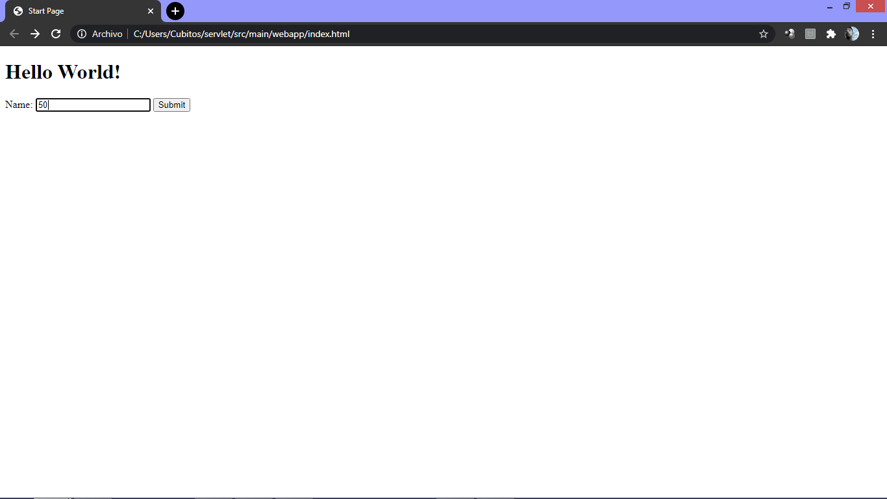
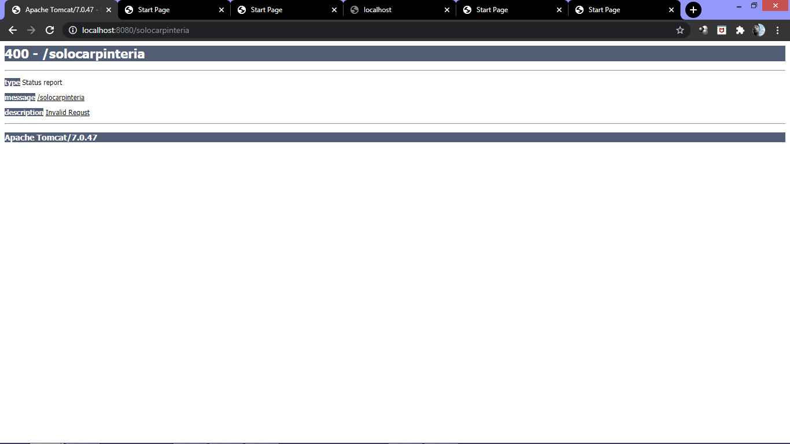

# **Laboratorio N°5**
##**CVDS-1**
###**Ciclos de Vida del Desarrollo de Software**


## Parte I. - Jugando a ser un cliente HTTP

Mediane la consola se realiza la conexion sincrona **TCP/IP** a atraves de Telnet a:

Telnet es el nombre de un protocolo de red que nos permite acceder a otra máquina para manejarla remotamente como si estuviéramos sentados delante de ella. También es el nombre del programa informático que implementa el cliente.
tomado de (Telnet)[1]

**Host:** www.escuelaing.edu.co
**Puerto:** 80

Segun la pagina 36 del (RFC del protocol HTTP)[2] la peticion con el comando get se realiza con el siguiente comando:


```
GET /sssss/abc.html HTTP/1.0
```


Para realizar la peticion del recurso **‘sssss/abc.html’** usando la version 1.0 de http
es de gran importancia presioan **ENTER** dos veces para ingresar al comando

#### ¿Qué codigo de error sale?
	
El codigo que salio fue el 301 lo que significa que **Se movio el recurso de manera permanente**

#### ¿Qué otros códigos de error existen?, ¿En qué caso se manejarán?

Codigos de error existen los siguientes:
	
+ **400 Peticion incorrecta:** El servidor no logro encontrar o procesar la solicitud por un error aparente del cliente como sintaxis, tamaño o enrutamiento
+ **401 No autorizado:** es similar al error 403, se trata del error lanzado cuando la autentificacion no se proporciono o es incorrecta
+ **402 Pago rquerido:** Este codigo esta reservado para uso futuro, en el cual se puedan notificar errores en pagos digitales, pero actualmente algunas empresas lo han utilizado para expresas otras cosas como Google debelopers que lo usa en caso de que el usuario haya superado el limite diario de solicitudes
+ **403 Prohibido:** La solicitud realzada es correcta debido a que si tiene los datos validos y el servidor la entiende, pero el servidor la esta rechazando, esto puede darse por gestion de permisos, necesita una cuenta especifica o son acciones prohibidas
+ **404 No encontrado:** No fue posible encontrar el recurso solicitado
+ **405 Metodo no permitido:** No se admite un método de solicitud para el recurso solicitado; por ejemplo, una solicitud GET en un formulario que requiere que los datos se presenten a través de POST , o una solicitud PUT en un recurso de solo lectura.
+ **406 No aceptable:**El recurso solicitado es capaz de generar solo contenido no aceptable de acuerdo con los encabezados de aceptación enviados en la solicitud.
+ **407 Se requiere autenticación de proxy:**El cliente primero debe autenticarse con el proxy 
+ **48 Solicitar tiempo de espera:**El servidor agotó el tiempo de espera de la solicitud. De acuerdo con las especificaciones HTTP: "El cliente no produjo una solicitud dentro del tiempo en que el servidor estaba preparado para esperar. El cliente PUEDE repetir la solicitud sin modificaciones en cualquier momento posterior". 
+ **409 Conflicto:**Indica que la solicitud no se pudo procesar debido a un conflicto en el estado actual del recurso, como un conflicto de edición entre varias actualizaciones simultáneas.
+ **410 desaparecido:** Indica que el recurso solicitado ya no está disponible y no volverá a estar disponible. Esto debe usarse cuando un recurso se ha eliminado intencionalmente y el recurso debe purgarse. 
+ **411 Longitud requerida:**La solicitud no especificó la longitud de su contenido, que es requerida por el recurso solicitado.
+ **412 Precondición fallida:** El servidor no cumple una de las condiciones previas que el solicitante puso en los campos del encabezado de la solicitud.
+ **413 Carga útil demasiado grande:** La solicitud es mayor de lo que el servidor desea o puede procesar. Anteriormente llamado "entidad de solicitud demasiado grande".
+ **414 URI demasiado largo:** El URI proporcionado era demasiado largo para que el servidor lo procesara. A menudo, el resultado de la codificación de demasiados datos como una cadena de consulta de una solicitud GET, en cuyo caso debe convertirse en una solicitud POST. Anteriormente denominado "Request-URI Too Long".
+ **415 Tipo de medio no admitido:** La entidad de solicitud tiene un tipo de medio que el servidor o recurso no admite. Por ejemplo, el cliente carga una imagen como image / svg + xml , pero el servidor requiere que las imágenes usen un formato diferente.
+ **416 Rango no satisfactorio:** El cliente ha solicitado una parte del archivo ( servicio de bytes ), pero el servidor no puede proporcionar esa parte. Por ejemplo, si el cliente solicita una parte del archivo que se encuentra más allá del final del archivo. Anteriormente denominado "Rango solicitado no satisfactorio". 
+ **417 Expectativa fallida:**El servidor no puede cumplir con los requisitos del campo Expect request-header.
+ **418 Soy una tetera:**Este código se definió en 1998 como una de las bromas tradicionales de IETF April Fools , en RFC 2324 , Protocolo de control de cafetera Hyper Text , y no se espera que sea implementado por servidores HTTP reales
+ **421 Solicitud mal dirigida:** La solicitud se dirigió a un servidor que no puede producir una respuesta
+ **422 Entidad no procesable :** La solicitud estaba bien formada, pero no se pudo seguir debido a errores semánticos
+ **423 Bloqueado:** El recurso al que se accede está bloqueado.
+ **424 Dependencia fallida:** La solicitud falló porque dependía de otra solicitud y esa solicitud falló
+ **425 demasiado pronto:**Indica que el servidor no está dispuesto a correr el riesgo de procesar una solicitud que podría reproducirse.
+ **426 Requiere actualización:**El cliente debe cambiar a un protocolo diferente, como TLS / 1.0 , que se proporciona en el campo de encabezado de actualización 
+ **428 Requisito previo:**El servidor de origen requiere que la solicitud sea condicional. Con la intención de evitar el problema de la 'actualización perdida', donde un cliente obtiene el estado de un recurso, lo modifica y lo devuelve al servidor, cuando mientras tanto un tercero ha modificado el estado en el servidor, lo que lleva a un conflicto.
+ **429 Demasiadas solicitudes:**El usuario ha enviado demasiadas solicitudes en un período de tiempo determinado. Diseñado para su uso con esquemas de limitación de velocidad .
+ **431 Campos de encabezado de solicitud demasiado grandes:**El servidor no está dispuesto a procesar la solicitud porque un campo de encabezado individual o todos los campos de encabezado en conjunto son demasiado grandes.
+ **451 No disponible por motivos legales:**Un operador de servidor ha recibido una demanda legal para denegar el acceso a un recurso oa un conjunto de recursos que incluye el recurso solicitado. 


Ahora realizamos otra conexion pero esta vez a:

**Host:** www.httpbin.org
**Puerto:** 80
**Version:** HTTP: 1.1

imagen3

y la peticion sera el recurso **/html**

```
GET /html HTTP/1.1
```

imagen 4

#### ¿Qué se obtiene como resultado?

En esta ocasion la peticion si fue aceptada, y como resultado obtenemos el archivo html en pantalla donde se encuentra un texto largo como se ve en la pagina anterior, con el debido encapezado de respuesta y el cuerpo


****¡Muy bien!, ¡Acaba de usar del protocolo HTTP sin un navegador Web!. Cada vez que se usa un navegador, éste se conecta a un servidor HTTP, envía peticiones (del protocolo HTTP), espera el resultado de las mismas, y -si se trata de contenido HTML- lo interpreta y dibuja.****

Con el siguiente comando se busca contar las palabras como lo dicen las siglas del comando **wc --> world count**

No presionar mas de dos veces _control D_ ya que podria cerrar la consola
```
wc -c 
```

pegar el texto que nos entrego el get anterior de manra que podamos contar el numero de caracteres que tiene este texto, esto porque se complemento el comando con **-c** para llegar al final del texto oprimir _control D_

imagen5

####¿Cuál es la diferencia entre los verbos GET y POST? 
Get y Post tienen similitudes sin embargo la diferencia mas grande se basa en que get se usa generalmente para realizar peticiones, y post se utiliza para realizar peticiones pero a su ves enviando parametros, aunque GET puede hacerlo tiene grandes limitaciones es por esto que se utiliza el POST El contenido va en el body del request, no aparece nada en la URL, aunque se envía en el mismo formato que con el método GET. Si se quiere enviar texto largo o cualquier tipo de archivo este es el método apropiado.

####¿Qué otros tipos de peticiones existen?
+ Get --> Leer la representacion de un recurso, devuelve la representacion en un formato concreto HTML, XML, JSON o imágenes, JavaScript, CSS, etc.
+ Post --> Crear o ejecutar mediante peticiones en donde se envian datos o parametros
+ Update --> Actualizar recursos
+ Put --> Actualizaciones parciales de los recursos, tambien puede crear recursos, no mestra ninguna informacion en la URL, a diferencia de POST es idempotente, mantiene el mismo estado que en la primera llamada, a menos de que sea modificado
+ Delete --> Eleminar recursos

Ahora veremos que nos arroja el comando curl el cual usaremos para comparar, debido a que este es el que se usa en la practica

```
curl www.httpbin.org
```

imagen6

```
curl -v www.httpbin.org
```
imagen 7

```
curl -i www.httpbin.org
```
imagen8

#### ¿Cuáles son las diferencias con los diferentes parámetros?

Con el comando ```curl -v www.httpbin.org``` fue posible evidenciar el detalle de la conexion, mostrando la direccion IP el puerto y el host ademas de poder observar si fue aceptado, posterior a esto se evidencia la pagina web

imagen9

Con el comando ```curl -i www.httpbin.org``` fue posible evidenciar la fecaha y hora en que se realizo la consulta del HTML, con la longitud, el tipo de conexion, y el servidor al cual se conecto para fianalmente mostrar la pagina HTML

imagen10

# Parte II. - Haciendo una aplicación Web dinámica a bajo nivel.
## La clase SampleServlet incluida a continuacion.

```
	@WebServlet(
        urlPatterns = "/helloServlet"
    )
    public class SampleServlet extends HttpServlet{
        static final long serialVersionUID = 35L;

      @Override
     protected void doGet(HttpServletRequest req, HttpServletResponse resp) throws ServletException, IOException {
         Writer responseWriter = resp.getWriter();
         Optional<String> optName = Optional.ofNullable(req.getParameter("name"));
         String name = optName.isPresent() && !optName.get().isEmpty() ? optName.get() : "";

         resp.setStatus(HttpServletResponse.SC_OK);
         responseWriter.write("Hello" + name + "!");
         responseWriter.flush();
     }
  }
```

    
   
   Le solicita algo a la pagina y si todo sale bien, no se le agrega anda mas y  logra conectar, escribe hello name!
   
   ## Compile y ejecute la aplicación en el servidor embebido Tomcat, a través de Maven con:
 ```
    mvn package 
    mvn tomcat7:run
 ```
    
 
    
   ## Abrimos un navegador, y en la barra de direcciones pusimos la URL con la cual se le enviarán peticiones al ‘SampleServlet’.
   ```
    http://localhost:8080/
   ```
   
  
   
    
   ## Observe que el Servlet ‘SampleServlet’ acepta peticiones GET, y opcionalmente, lee el parámetro ‘name’. Ingrese la misma URL, pero ahora agregando un parámetro GET 
   Agregamos nuestros nombres
    
   
   ## Busque el artefacto gson en el repositorio de maven y agregue la dependencia.
   ```
    <dependency>
     <groupId>com.google.code.gson</groupId>
     <artifactId>gson</artifactId>
     <version>2.8.6</version>
     </dependency>

   ```
   
   ## En el navegador revise la dirección https://jsonplaceholder.typicode.com/todos/1. Intente cambiando diferentes números al final del path de la url.
   Al cambiar los numeros cambia el id y el titulo escrito en latin, y el completed va cambiandro de estado.
   

     
   ## Basado en la respuesta que le da el servicio del punto anterior, cree la clase edu.eci.cvds.servlet.model.Todo con un constructor vacío y los métodos getter y setter para las propiedades de los "To Dos" que se encuentran en la url indicada.
   

  
  
   ## Cree una clase que herede de la clase HttpServlet (similar a SampleServlet), y para la misma sobrescriba el método heredado doGet. Incluya la anotación @Override para verificar –en tiempo de compilación- que efectivamente se esté sobreescribiendo un método de las superclases.
   
   


   ## Una vez hecho esto, verifique el funcionamiento de la aplicación, recompile y ejecute la aplicación.
 
 
 
 
 
 
 
  ## Intente hacer diferentes consultas desde un navegador Web para probar las diferentes funcionalidades.
  
 
 
 
 
 
 
 
 # Parte III
 ## En su servlet, sobreescriba el método doPost, y haga la misma implementación del doGet.
 Se hizo la misma implementacion que para doGet
 ## Cree el archivo index.html en el directorio src/main/webapp/index.html de la siguiente manera:
 
  ```
  <!DOCTYPE html>
<html>
    <head>
        <title>Start Page</title>
        <meta http-equiv="Content-Type" content="text/html; charset=UTF-8">
    </head>
    <body>
        <h1>Hello World!</h1>
    </body>
</html>

   ```
 
 ## En la página anterior, cree un formulario que tenga un campo para ingresar un número (si no ha manejado html antes, revise http://www.w3schools.com/html/ ) y un botón
 
 
 
 
 
 ## Cambie el formulario para que ahora en lugar de POST, use el método GET . Qué diferencia observa?
 Ninguna
 
 ### Parte IV. - Frameworks Web MVC – Java Server Faces / Prime Faces

1. Primeramente es de gran importancia generar el proyecto, y posteriormente realizar la adicion de las siguientes dependencias en sus ultimas versiones:

+ javax.javaee-api
+ com.sun.faces.jsf-api
+ com.sun.faces.jsf-impl
+ javax.servlet.jstl
+ Primefaces

2. Para que configure automáticamente el descriptor de despliegue de la aplicación (archivo web.xml), de manera que el framework JSF se active al inicio de la aplicación, en el archivo web.xml agregue la siguiente configuración:

imagen12

3. Revise cada una de las configuraciones agregadas anteriormente para saber qué hacen y por qué se necesitan. Elimine las que no se necesiten.

En el archivo web.xml es posible tener la configuracion y despligue de los componentes web que conlleva la aplicacion web

FacesServlet es un servlet que administra el ciclo de vida de procesamiento de solicitudes para aplicaciones web que utilizan JavaServer Faces para construir la interfaz de usuario. (Docs Oracle)[3]

Los Servlets son módulos escritos en Java que se utilizan en un servidor, que puede ser o no ser servidor web, para extender sus capacidades de respuesta a los clientes al utilizar las potencialidades de Java. Los Servlets son para los servidores lo que los applets para los navegadores, aunque los servlets no tienen una interfaz gráfica. (uChile)[4]

No se elimino ninguna configuracion ya que se considera que todas son necesarias para la ejecucion de la aplicacion web


##### Autores:
 * Santiago Buitrago
 * Andres Cubillos

[1]:https://es.wikipedia.org/wiki/Telnet
[2]:https://tools.ietf.org/html/rfc2616
[3]:https://docs.oracle.com/javaee/7/api/javax/faces/webapp/FacesServlet.html
[4]:https://users.dcc.uchile.cl/~jbarrios/servlets/general.html

