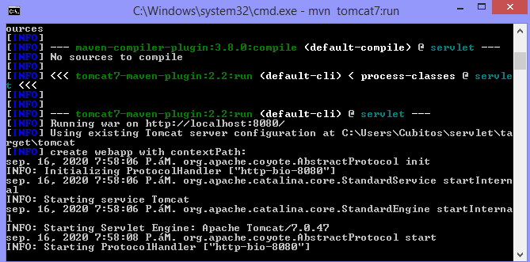
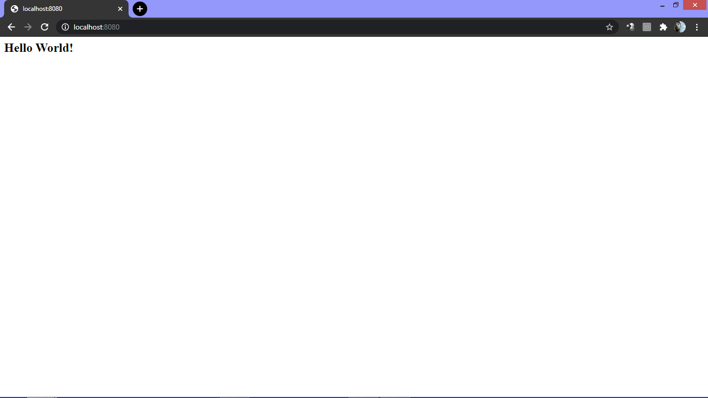
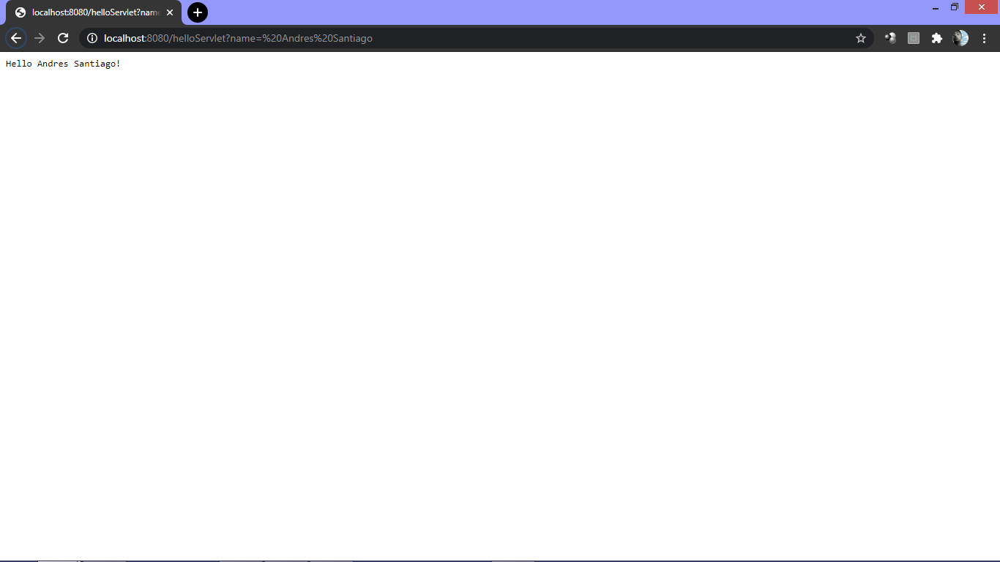
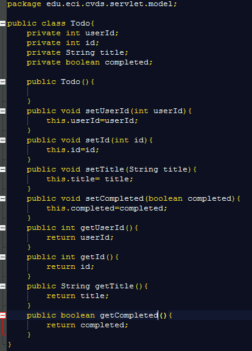
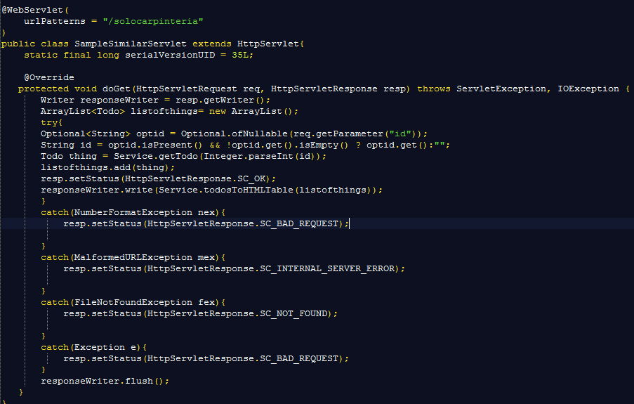
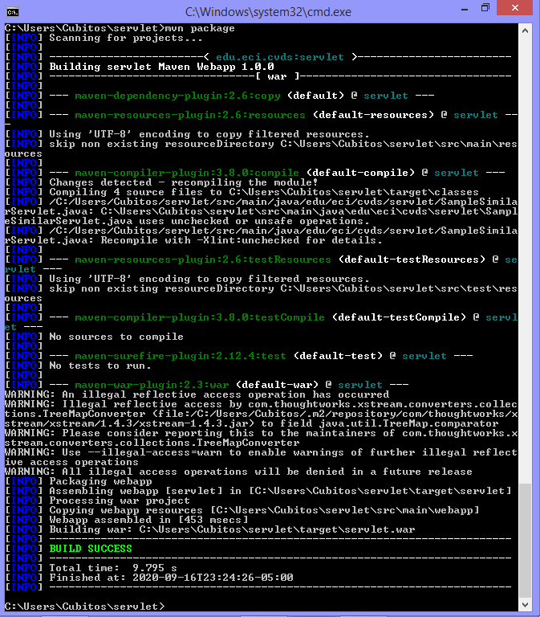
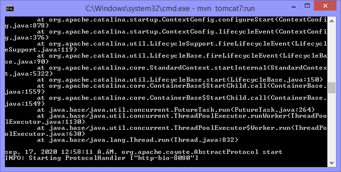
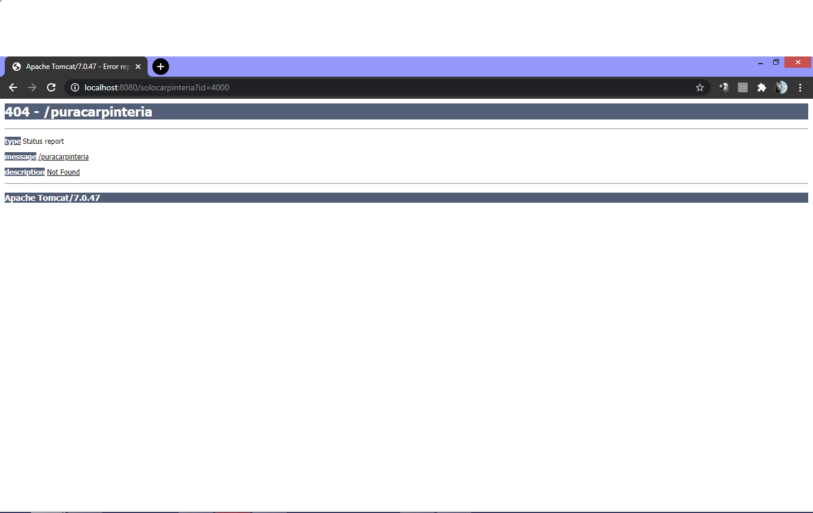
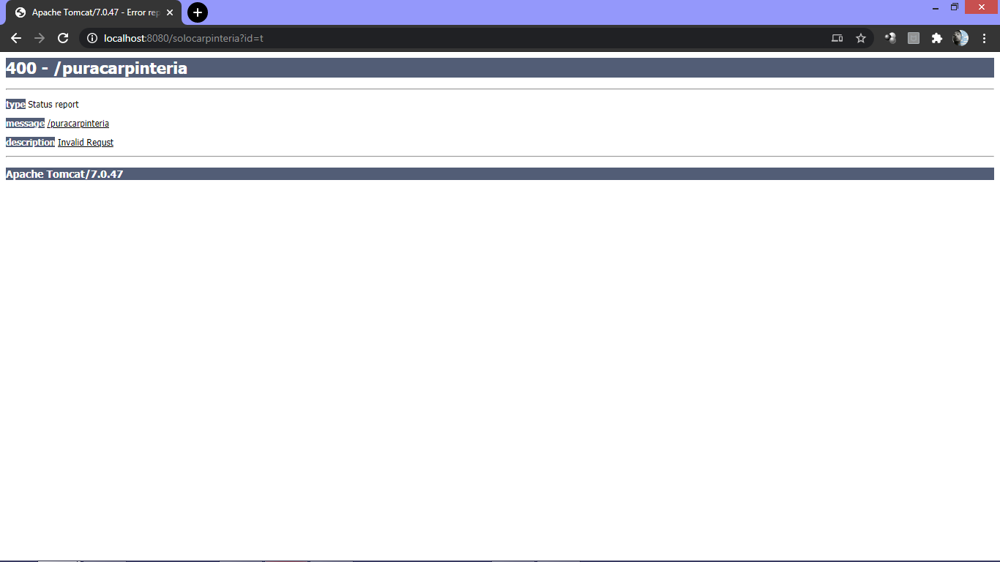

# LAB5CVDS
Andres Felipe Cubillos Hurtado
Brayan Santiago Buitrago

# Parte II. - Haciendo una aplicación Web dinámica a bajo nivel.
## La clase SampleServlet incluida a continuacion.

```
	@WebServlet(
        urlPatterns = "/helloServlet"
    )
    public class SampleServlet extends HttpServlet{
        static final long serialVersionUID = 35L;

      @Override
     protected void doGet(HttpServletRequest req, HttpServletResponse resp) throws ServletException, IOException {
         Writer responseWriter = resp.getWriter();
         Optional<String> optName = Optional.ofNullable(req.getParameter("name"));
         String name = optName.isPresent() && !optName.get().isEmpty() ? optName.get() : "";

         resp.setStatus(HttpServletResponse.SC_OK);
         responseWriter.write("Hello" + name + "!");
         responseWriter.flush();
     }
  }
```

    
   
   Le solicita algo a la pagina y si todo sale bien, no se le agrega anda mas y  logra conectar, escribe hello name!
   
   ## Compile y ejecute la aplicación en el servidor embebido Tomcat, a través de Maven con:
 ```
    mvn package 
    mvn tomcat7:run
 ```
    
 
    
   ## Abrimos un navegador, y en la barra de direcciones pusimos la URL con la cual se le enviarán peticiones al ‘SampleServlet’.
   ```
    http://localhost:8080/
   ```
   
  
   
    
   ## Observe que el Servlet ‘SampleServlet’ acepta peticiones GET, y opcionalmente, lee el parámetro ‘name’. Ingrese la misma URL, pero ahora agregando un parámetro GET 
   Agregamos nuestros nombres
    
   
   ## Busque el artefacto gson en el repositorio de maven y agregue la dependencia.
   ```
    <dependency>
     <groupId>com.google.code.gson</groupId>
     <artifactId>gson</artifactId>
     <version>2.8.6</version>
     </dependency>

   ```
   
   ## En el navegador revise la dirección https://jsonplaceholder.typicode.com/todos/1. Intente cambiando diferentes números al final del path de la url.
   Al cambiar los numeros cambia el id y el titulo escrito en latin, y el completed va cambiandro de estado.
   

     
   ## Basado en la respuesta que le da el servicio del punto anterior, cree la clase edu.eci.cvds.servlet.model.Todo con un constructor vacío y los métodos getter y setter para las propiedades de los "To Dos" que se encuentran en la url indicada.
   

  
  
   ## Cree una clase que herede de la clase HttpServlet (similar a SampleServlet), y para la misma sobrescriba el método heredado doGet. Incluya la anotación @Override para verificar –en tiempo de compilación- que efectivamente se esté sobreescribiendo un método de las superclases.
   
   



   ## Una vez hecho esto, verifique el funcionamiento de la aplicación, recompile y ejecute la aplicación.
 
 
 
 
 
 
 
  ## Intente hacer diferentes consultas desde un navegador Web para probar las diferentes funcionalidades.
  
 
 
 
 
 
 
 
 # Parte III
 # En su servlet, sobreescriba el método doPost, y haga la misma implementación del doGet.
